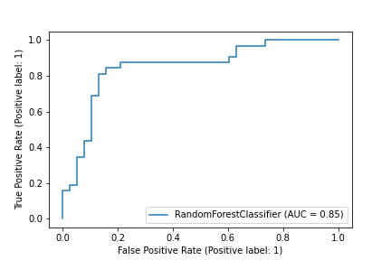
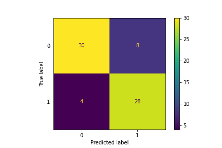

Predição da necessidade de internação na UTI de pacientes com COVID-19 usando *Machine Learning*.
==============================


<a href="http://www.freepik.com">Designed by Freepik</a>

# Sumário
<!--ts-->
   * [Apresentação](#apre)
   * [Objetivo](#res)
   * [Situação](#sit)
   * [Plano](#plan)
   * [Execução](#exec)
   * [Resultados](#result)
   * [Conclusões](#concl)
   * [Contato](#contato)
   * [Organização do projeto](#porg)
<!--te-->

<a name="apre"></a>
# Apresentação ✌️
Oiee! Eu me chamo Filipi Rigui, sou Engenheiro de Controle e Automação e nas horas que consigo, estudo *Data Science*.<br> Esse projeto é a entrega final do **Bootcamp de Data Science Aplicada da [Alura](https://www.alura.com.br/)**.<br>
Espero que gostem...<br>

<a name="res"></a>
# Objetivo 📝
O objetivo é avaliar os dados disponibilizados pelo time de *Data Intelligence* do Hospital Sírio-Libanês, que contém informações de um conjunto de pacientes atendidos pelo hospital e que estavam acometidos pela COVID-19, para assim criar um modelo de predição que seja capaz de classificar esses pacientes entre aqueles cujo quadro clínico evoluiria a ponto de ser necessária a transferência para a unidade de tratamento intensivo (UTI) e os que permaneceriam em uma situação estável até a sua alta.<br>

<a name="sit"></a>
# Situação 🌎
O mundo se encontra em alerta com o aparecimento de um novo vírus e suas mutações.<br>
O vírus **coronavírus SARS-CoV-2** causa uma infecção respiratória chamada de **Covid-19** que foi fatal para quase 5.000.000 de pessoas em todo o mundo.<br>
Na tentativa de minimizar, ou até mesmo eliminar os problemas causados pelo vírus, a comunidade médica/científica vem trabalhando árduamente.<br>
Uma maneira de minimizar as mortes pela infecção respiratória se dá pelo tratamento intensivo, nas UTIs dos hospitais, com o entubamento e medicamento apropriado. O problema é que muitas vezes, principalmente quando se tem um avanço no contagio, as UTIs ficam cheias, e ter um suporte no auxilio da tomada de decisão, indicando com antecedência os potenciais casos que se agravariam a ponto de precisar de um leito de UTI, poderia ajudar muito os médicos, na gestão dos leitos do hospital, e na negociação e transferencia dos pacientes quando se fizer necessário.

<a name="plan"></a>
# Plano 🤓
## Workflow
A estratégia tomada para chegar na definição do modelo passa por alguns passos, que são:
1. Enrendendo o modelo
2. Ingestão dos dados
3. Limpeza dos dados
4. Feature Engineering
5. Modelo

Esse workflow pode ser usado em casos reais, mais é necessário ter em mente que cada fase supra-citada não é rígida e única, e dependendo da situação, loops se fazem necessários voltando em etapas anteriores de maneira a considerar novas informações que uma etapa posterior levantou, então, por exemplo, na etapa de *feature engineering*, pode se ter uma idéia melhor sobre uma feature importante, e se faça necessário voltar um passo e refinar a *limpeza dos dados*, e assim por diante.

## Métrica de avaliação
A métrica de avaliação da performance do modelo se dará por meio do critério de **ROC_AUC**. Essa métrica foi explicada em maiores detalhes no Notebook [**Modelo**](https://github.com/fdrigui/covid19_icu_admission_prediction/blob/main/notebooks/4.0_Modeling.ipynb), no tópico *Métrica de avaliação*.<br>
Basicamente a métrica **ROC_AUC** avalia o quão bem o modelo consegue dividir os dados entre as categorias de saída, ou seja, qão bem o modelo divide os pacientes que não foram para a UTI daqueles que acabaram precisando serem encaminhados para um leito de tratamento intesívo.


<a name="exec"></a>
# Execução 👊
A execulção do plano foi dividida em categorias, ficando assim mais fácil de ser compreendida.
<!--ts-->
   * [Entendendo o dado](https://github.com/fdrigui/covid19_icu_admission_prediction/blob/main/notebooks/0.0_understanding_the_data.md)
   * [Ingestão dos dados](https://github.com/fdrigui/covid19_icu_admission_prediction/blob/main/notebooks/1.0_ingest_raw_data.ipynb)
   * [Limpeza dos dados](https://github.com/fdrigui/covid19_icu_admission_prediction/blob/main/notebooks/2.0_clean_data.ipynb)
   * [Feature Engineering](https://github.com/fdrigui/covid19_icu_admission_prediction/blob/main/notebooks/3.0_feature_engineering.ipynb)
   * [Modelo](https://github.com/fdrigui/covid19_icu_admission_prediction/blob/main/notebooks/4.0_Modeling.ipynb)
<!--te-->

<a name="result"></a>
# Resultados 🎯
O Resultado final foi obtido usando o modelo **RandomForestClassifier** da biblioteca **scykit-learn**.<br>
O **ROC_AUC** médio foi de **80%**, com um desvio padrão de **5.2%**<br>

*O valor do ROC_AUC do gráfico é de 0.85. Lembre-se que 0.8 é um valor médio, que varia dependendo da divisão dos dados de treino e teste, essa figura é ilustrativa e representa uma curva próxima da curva média*<br><br>
Outra ferramenta boa para visualizar onde estão os erros e acertos do modelo é a **Matriz de Confusão**, como pode ser vista abaixo:
<br>
Nesse caso, podemos ver que das 70 amostras utilizadas para testar o modelo:
* 30 amostras deram verdadeiro negativo, indicando que o modelo estimou que os pacientes não iriam para a UTI e o modelo *acertou*
* 28 amostras deram verdadeiro positivo, indicando que o modelo estimou que os pacientes precisariam ser encaminhados para a UTI no futuro, e o modelo *acertou*.
* 8 amostras deram falso positivo, indicando que o modelo estimou que os pacientes iriam ser encaminhados para a UTI e o modelo *errou*.
* 4 pacientes deram falso negativo, idnicando que o modelo estimou que os pacientes não evoluiriam para a UTI, e o modelo *errou*.<br>


Vemos então que dos **70** pacientes avaliados pela amostra de testes, o modelo acertou **58** e errou **12**, o que representa **83%** de acerto.

<a name="result"></a>
# Conclusões 🚩
O objetivo foi atingido, uma vez que temos um modelo de machine learnning consegue prever com razoavel qualidade os pacientes cujo quadro de saúde evoluiriam ou não para a UTI após a entrada no hospital.<br>
O Modelo pode ser encontrado no caminho ```./models/RF_compressed.joblib```<br>


<a name="contato"></a>
# Contato 🍕
Caso queira me encontrar, me chame no [**linkedin**](https://www.linkedin.com/in/filipirigui/).
Caso tenha alguma dúvida, sugestão de melhoria, ou simplesmente ampliar o seu network, será um prazer te-lo em meus contatos!

<a name="porg"></a>
# Organização do projeto
------------

    ├── LICENSE
    ├── README.md          <- The top-level README for developers using this project.
    ├── data
    │   ├── external       <- Data from third party sources.
    │   ├── interim        <- Intermediate data that has been transformed.
    │   ├── processed      <- The final, canonical data sets for modeling.
    │   └── raw            <- The original, immutable data dump.
    │
    ├── models             <- Trained and serialized models, model predictions, or model summaries
    │
    ├── notebooks          <- Jupyter notebooks. Naming convention is a number (for ordering),
    │                         the creator's initials, and a short `-` delimited description, e.g.
    │                         `1.0-jqp-initial-data-exploration`.
    │
    ├── references         <- Data dictionaries, manuals, and all other explanatory materials.
    │
    ├── reports            <- Generated analysis as HTML, PDF, LaTeX, etc.
    │   └── figures        <- Generated graphics and figures to be used in reporting
    │
    ├── requirements.txt   <- The requirements file for reproducing the analysis environment, e.g.
    │                         generated with `pip freeze > requirements.txt`
    │
    └── src                <- Source code for use in this project.


--------

<p><small>Project based on the <a target="_blank" href="https://drivendata.github.io/cookiecutter-data-science/">cookiecutter data science project template</a>. #cookiecutterdatascience</small></p>
